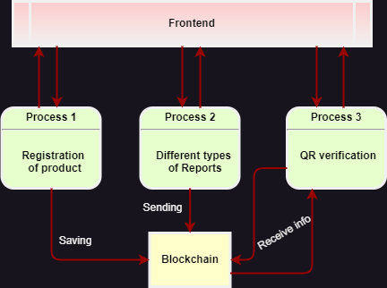

# WAREHOUSE
This project is a modern warehouse system developed using the Python language and the FastAPI framework. It is designed to automate and optimize warehouse management processes, starting from the arrival of goods at the warehouse and ending with the shipment of goods.

## Project description:
The following key functions were developed as part of the project:

- Reception of goods:
  - The system allows warehouse operators to quickly and accurately record the receipt of goods, including information about the quantity, condition and location of goods in the warehouse
- Product placement:
  - The project provides tools for optimal placement of goods in the warehouse, taking into account their characteristics and demand.
- Shipment of goods:
  - The system allows you to manage the process of shipment of goods, including the formation of orders, preparation of goods for shipment and monitoring of the delivery process.

#### Routers
**JSON data exchange format**

Swagger documentation is available at http://localhost:7777/docs/

1. /company/
    - This router is for a company. it will register, update and delete company.
2. /warehouse/
    - This router is for a warehouse. it will register, update and delete warehouse.
3. /user/
    - This router is for a user. it will register, update and delete user.
4. /order/
    - This router is for a order. it will register, update and delete order
5. /product/
    - This router is for a product. it will register, update and delete product
6. /report/
    - This router allows warehouse operators to quickly and accurately record the receipt of goods, including information about the quantity, condition and location of goods in the warehouse. it will register, update and delete report



## How to run

#### Prerequisites
- Docker installed
- Docker Compose installed
  
### Installing and Running the Application
1. Clone the project repository to your computer:
   
``` 
git clone git@github.com:Prometeochainsystem/warehouse_backend.git
```

3. Go to the project directory:

``` 
cd ./warehouse_backend
```

4. Run the application with Docker Compose:

``` 
docker-compose up --build
```

5. To stop the application, run the command:

``` 
docker-compose down
```

### Testing

Running unit tests

``` 
pytest ./tests
```
